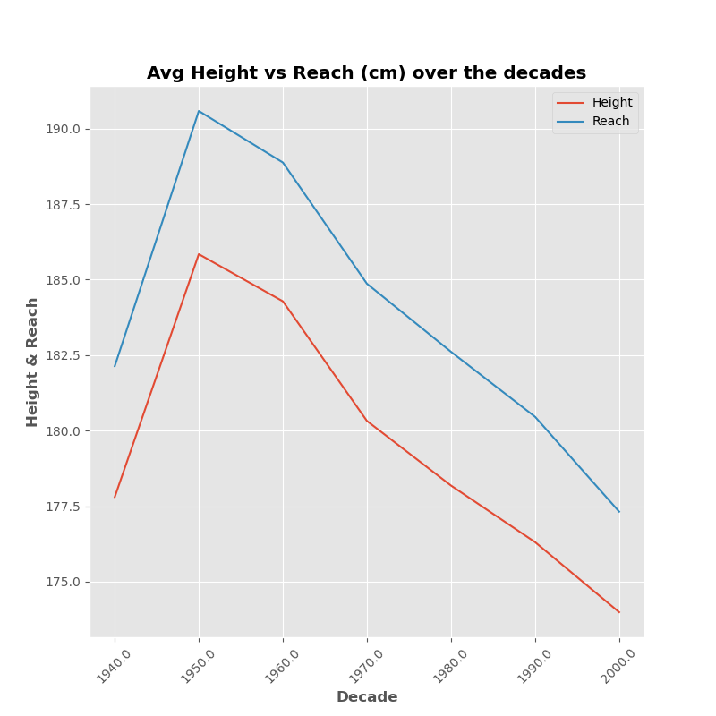
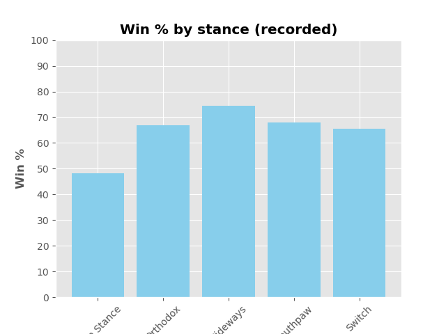
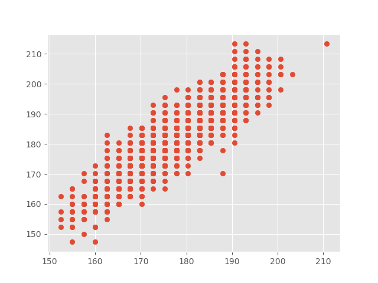
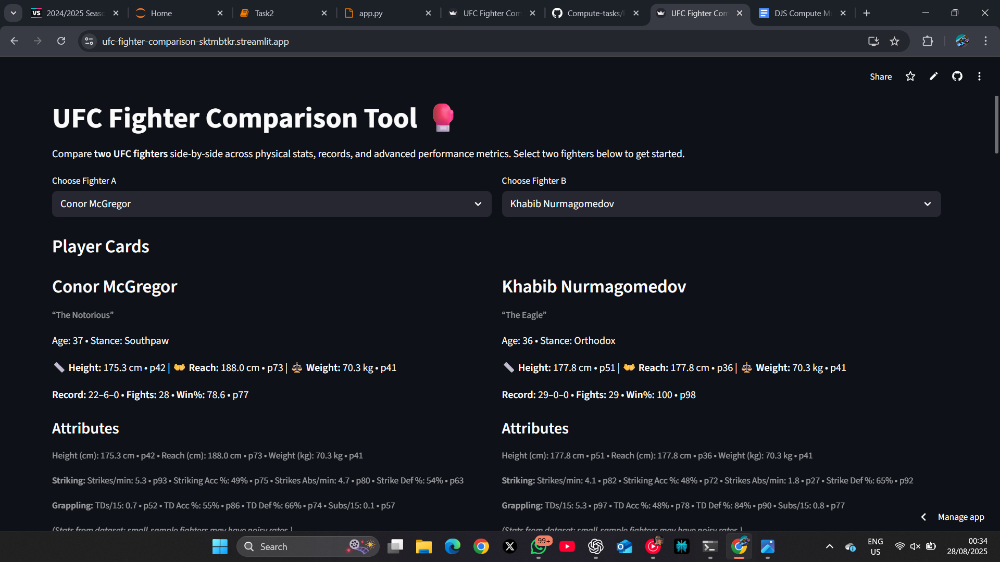
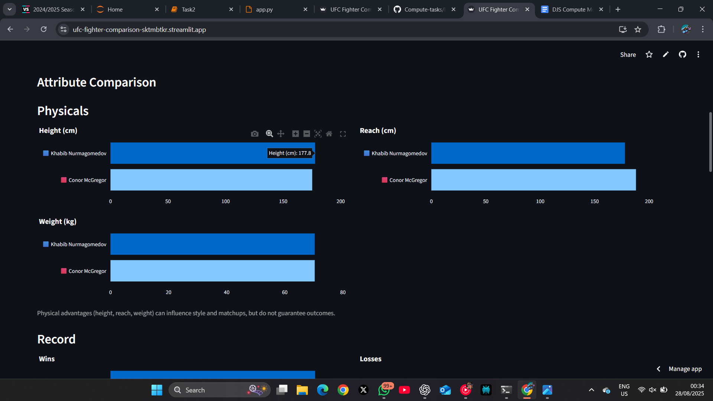
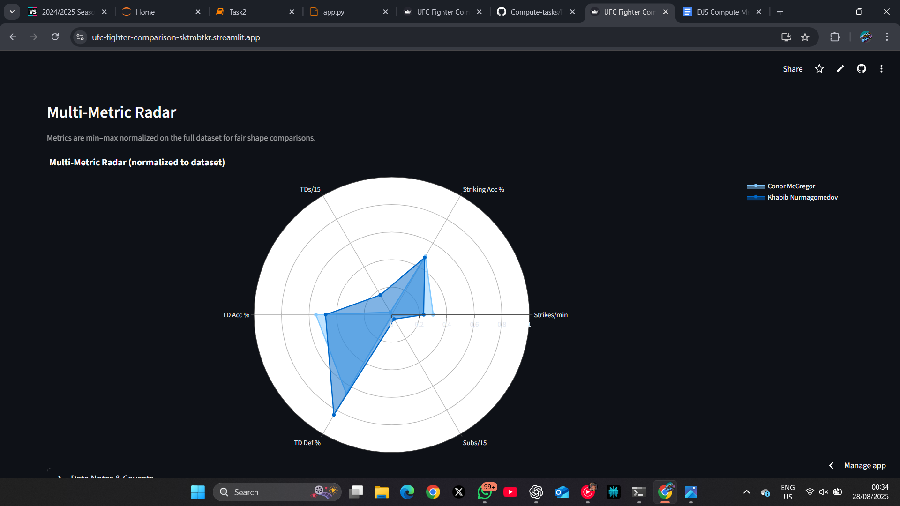

# Compute-tasks
# 🥊 UFC Fighters - Exploratory Data Analysis (EDA)

This project explores a dataset of ~4,000 UFC fighters, covering their **physical attributes**, **fight records**, and **performance metrics**.  
The aim was to clean and prepare the data, handle missing values, engineer useful features, and uncover insights into how different attributes relate to fighter performance.

---

## 🔧 Workflow
1. **Data Cleaning**
   - Converted `DOB` to datetime and calculated fighter **Age**.  
   - Dropped fighters with **0 fights** to avoid unstable stats.  
   - Standardized numeric columns (height, reach, weight, percentages).  

2. **Feature Engineering**
   - Added `Fights = Wins + Losses + Draws`.  
   - Added `Win% = Wins / Fights * 100`.  
   - Derived metrics such as **Ape Index** (Reach − Height) and **BMI** (optional).  

3. **Handling Missing Values**
   - **Reach** imputed using **linear regression** with height (and weight when available).  
   - Height/Reach set to `0` only when no information could be recovered.  
   - Some categorical fields (e.g., stance, DOB) left as `NaN` if unavailable.  

4. **Exploratory Analysis**
   - Distribution of **Height, Reach, Weight, Win%**.  
   - **Height vs Reach** relationship + outliers.  
   - Stance frequency and performance comparisons.  
   - Striking metrics: Strikes/min, Accuracy, Absorbed/min, Defense.  
   - Grappling metrics: TDs/15, TD Acc %, TD Def %, Subs/15.  
   - Correlation heatmap for all numeric metrics.  
   - Radar (spider) charts to profile fighters across multiple skills.  

---

## 📊 Key Insights
- **Height vs Reach**: Strong positive linear correlation, with a few outliers.  
- **Experience matters**: Fighters with more bouts have more stable Win%.  
- **Stance**: Orthodox is dominant; stance alone doesn’t drive win rates.  
- **Balanced profiles** (good striking + grappling) stand out in radar charts.  

---

## 🛠️ Tools
- Python (Pandas, NumPy)  
- Matplotlib & Seaborn (EDA plots)  
- Plotly (interactive visuals)  
- Scikit-learn (linear regression for Reach imputation)  
- Jupyter Notebook

  ## 📊 Sample Visuals

### Height vs Reach

### Stance Distribution

### Win% vs Fights

# 🥊 UFC Fighter Comparison App

A **Streamlit web app** to compare UFC fighters side-by-side across their physical stats, records, and performance metrics.  
Built using **Python, Pandas, Plotly, and Streamlit**.

🔗 **Live App:** [UFC Fighter Comparison](https://ufc-fighter-comparison-sktmbtkr.streamlit.app/)

---

## 🚀 Features

- Select **two fighters** from the UFC dataset.
- See **player cards** with:
  - Name, Nickname, Stance, Age
  - Height, Reach, Weight (with percentile badges)
  - Record: Wins–Losses–Draws, Fights, Win%
- **Attributes section** (Striking & Grappling metrics with percentiles).
- **Radar chart** comparing normalized performance across multiple metrics.
- Clean, responsive design built in Streamlit.

---

## 📊 Dataset

- Source: UFC fighters statistics dataset (`ufc_clean.csv`).
- Includes stats such as:
  - Wins, Losses, Draws, Win%
  - Strikes landed/min, Striking accuracy, Strikes absorbed/min
  - Takedowns per 15 min, Takedown accuracy, Takedown defense
  - Submissions attempted/15 min
  - Physical stats: Height, Reach, Weight

---

## 🛠️ Tech Stack

- [Python](https://www.python.org/)  
- [Pandas](https://pandas.pydata.org/)  
- [Plotly](https://plotly.com/python/) (interactive charts)  
- [Streamlit](https://streamlit.io/) (web framework)  

---

  ## 📊 Sample Visuals

# 🫁 Asthma Prediction - Model Fitting & Deployment

This task involved predicting whether a patient has **Asthma** or not using a **synthetically generated healthcare dataset**.  
The dataset contained patient demographics, lifestyle factors, comorbidities, and clinical test results.

---

## 📂 Dataset
- ~10,000 synthetic patient records.
- Target variable: **Has_Asthma** (0 = No, 1 = Yes).
- Features included:
  - Demographics: Age, Gender, BMI  
  - Lifestyle: Smoking Status, Physical Activity Level, Occupation  
  - Medical History: Family History, Allergies, Comorbidities, ER Visits  
  - Clinical Measurements: Medication Adherence, Peak Expiratory Flow (PEF), FeNO Level  

---

## 🔧 Workflow
1. **Data Preprocessing**
   - Dropped irrelevant fields: `Patient_ID`, `Asthma_Control_Level` (only available after diagnosis → leakage risk).  
   - Encoded categorical features using OneHotEncoder.  
   - Scaled numeric features with StandardScaler.  
   - Filled missing values (`Allergies`, `Comorbidities`) with `"Unknown"` or `"None"`.  

2. **Model Fitting**
   - Baseline models: Logistic Regression, Random Forest.  
   - Advanced model: XGBoost (Gradient Boosting).  
   - Train-test split (80/20) + cross-validation for tuning.  

3. **Evaluation Metrics**
   - Accuracy  
   - Precision  
   - Recall  
   - F1 Score  
   - ROC-AUC  

---

## 📊 Results

| Model                 | Accuracy | Precision | Recall | F1 Score | ROC-AUC |
|------------------------|----------|-----------|--------|----------|---------|
| Logistic Regression    | 0.9885   | 1.00      | 0.954  | 0.976    | 0.9999  |
| Random Forest          | 0.9955   | 1.00      | 0.982  | 0.991    | 0.9999  |
| XGBoost Classifier     | 0.9995   | 0.998     | 1.00   | 0.999    | 1.0000  |

⚠️ **Why are the scores so high?**  
- This dataset is **synthetic** and was generated with strong, clean correlations between features (like Family History, Pollution, Activity, Smoking, etc.) and the asthma outcome.  
- In real-world healthcare data, performance would be much lower due to **noise, missing values, and overlapping patient characteristics**.  
- No evidence of leakage in preprocessing → results are a property of the dataset.  

---

## 🚀 Deployment - Streamlit App

We built a **Streamlit web application** to make the model interactive.

🔗 **Live App:** [Asthma-Prediction](https://asthma-prediction-sktmtbkr.streamlit.app/)

### Features:
- Questionnaire-style inputs:
  - Demographics (Age, Gender, BMI with calculator)  
  - Lifestyle (Smoking, Pollution, Activity, Occupation)  
  - Medical history (Family history, Allergies, Comorbidities, ER visits)  
  - Clinical tests (Medication adherence, PEF, FeNO)  
- **BMI calculator**: enter height & weight if BMI is unknown.  
- **Prediction output** with probability and progress bar.  
- **Top 5 feature importance** (global, from XGBoost) shown as a bar chart.  

### Example Workflow:
1. User fills in patient details.  
2. Clicks **Predict**.  
3. Output shows:  
   - Prediction: *Asthma Detected* / *No Asthma*  
   - Probability (e.g. 89% chance)  
   - Probability bar  
   - Feature importance chart  

---

## 🛠️ Tools
- Python (Pandas, NumPy, Scikit-learn, XGBoost)  
- Streamlit (deployment)  
- Matplotlib & Seaborn (visualizations)  
